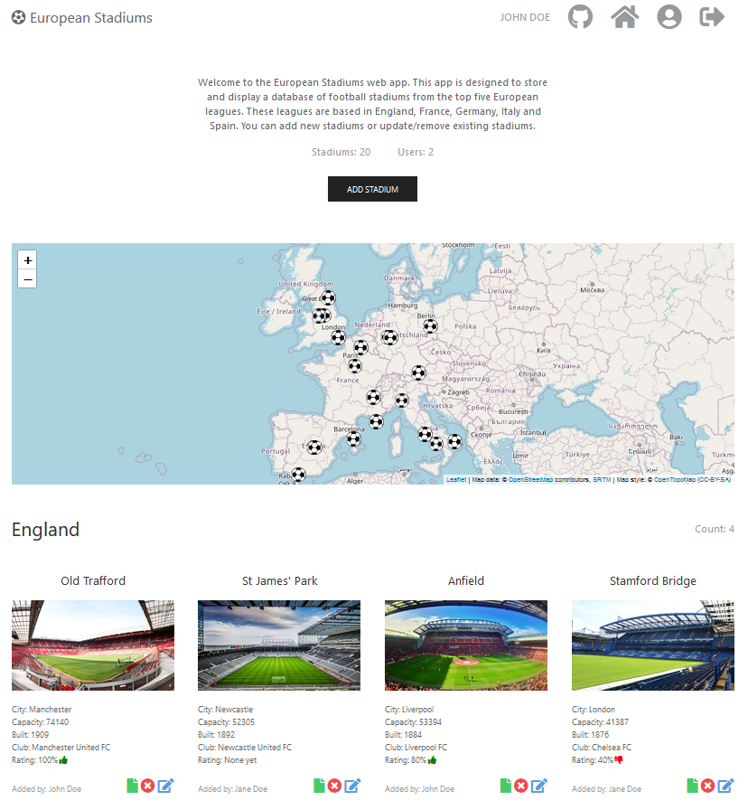

# European Stadiums Svelte

A single page Svelte application which displays a database of football stadiums from the top five European leagues.

These leagues are based in:

- England
- France
- Germany
- Italy
- Spain

## Features

- View stadium data and images
- View stadium location on map
- Add stadiums
- Edit existing stadiums
- Remove existing stadiums
- View reviews on Stadiums
- Edit/delete user account

This app is based on the server-rendered version of the app and makes use of it's API.

## Technologies

- HTML, JavaScript, CSS
- Svelte
- [ViteJS](https://vitejs.dev/)
- [UIKit](https://getuikit.com/)
- [svelte-spa-router](https://www.npmjs.com/package/svelte-spa-router)

## Usage

Having access to the API from the [server-rendered version](https://github.com/TonyN96/european-stadiums) of this app is a prerequisite.
By default the app is set to fetch API calls from the [Heroku version](https://european-stadiums.herokuapp.com/) of the server-rendered app.

```
# Clone the repository:
$ git clone https://github.com/TonyN96/european-stadiums-svelte.git

# Go into the repository
$ cd european-stadiums-svelte

# Install dependencies
$ npm install

# Run the app
$ npm run dev
```

